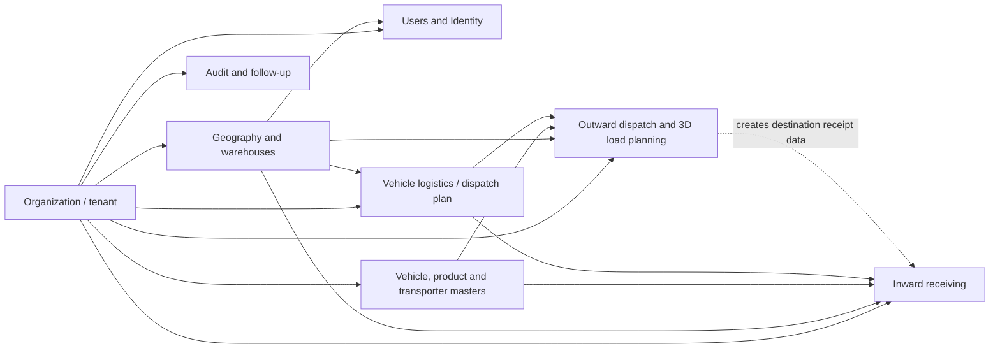
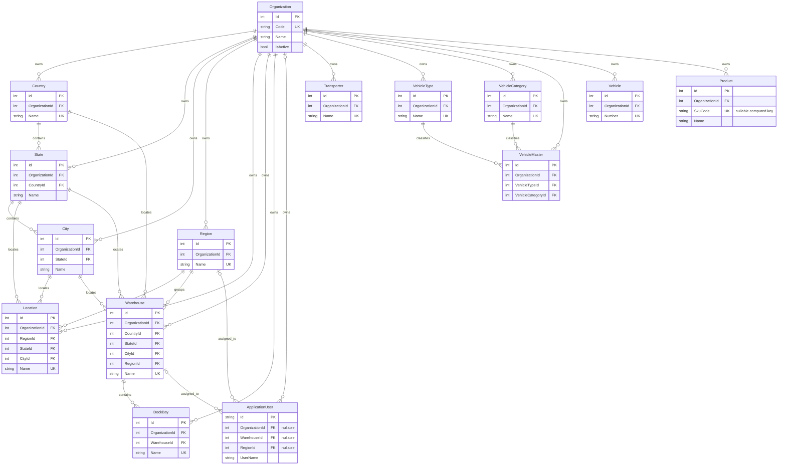
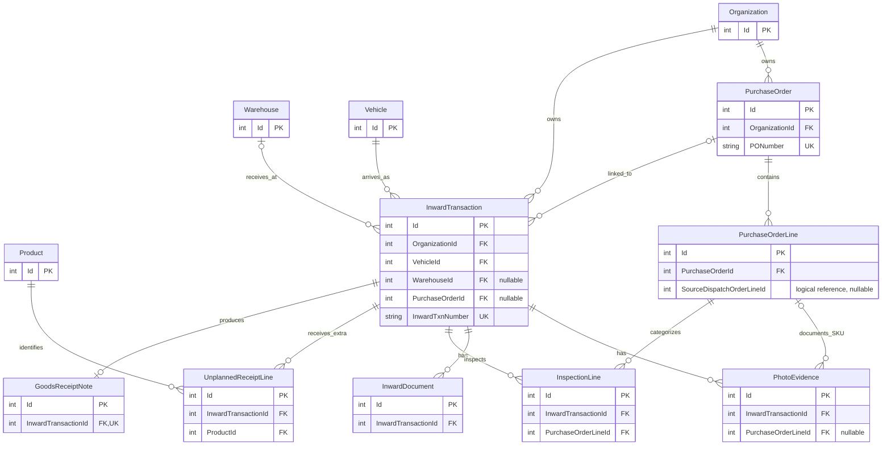
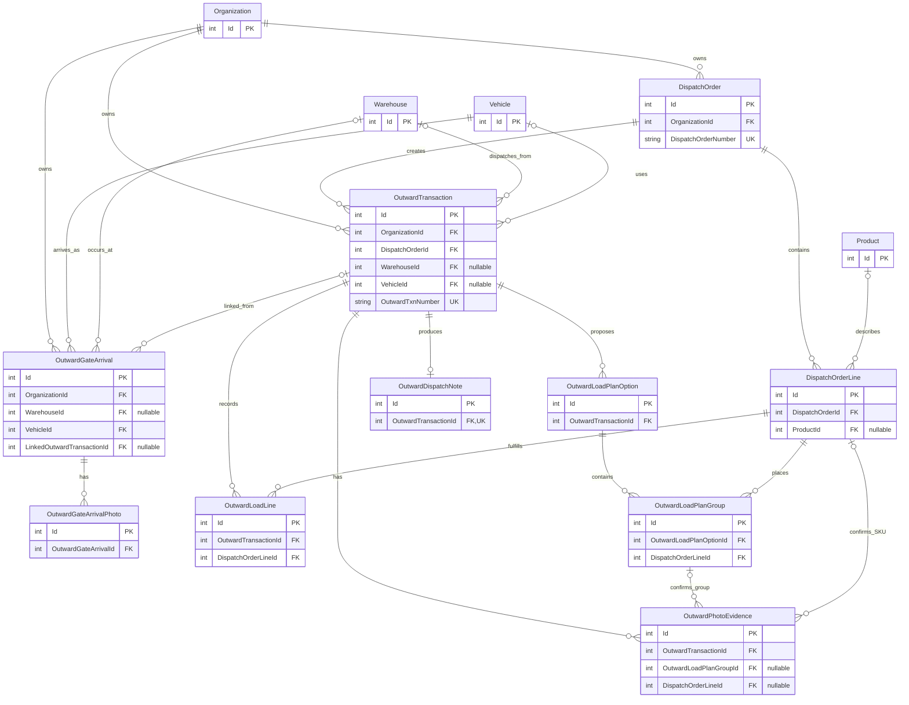
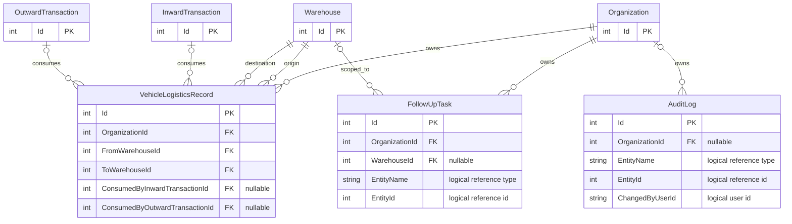
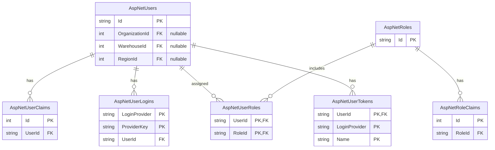

# WarehouseGate / LogiFlow database entity relationships

This document describes the EF Core model defined by `WarehouseGateDbContext` and the current
`WarehouseGateDbContextModelSnapshot`. It represents the persisted MySQL schema, not the mobile or
web DTO models.

## Legend

- `PK` — primary key
- `FK` — database-enforced foreign key
- `UK` — unique key/index (often tenant-scoped)
- `||` — exactly one
- `o|` — zero or one
- `o{` — zero or many
- Every entity implementing `ITenantScoped` has a required `OrganizationId` FK and a global tenant
  query filter. `ApplicationUser` and `AuditLog` have an optional tenant FK.

## High-level dependency map

## Tenant, geography, users and master data

Important unique constraints:

- `Organization.Code` is globally unique.
- Most master names are unique inside an organization: `(OrganizationId, Name)`.
- `Vehicle.Number` is unique inside an organization.
- A vehicle profile is unique by `(OrganizationId, VehicleTypeId, VehicleCategoryId)`.
- A dock name is unique by `(WarehouseId, Name)`.
- Non-empty product SKU codes are unique per organization through the computed
  `SkuCodeForUniqueness` column.

## Inward receiving

Dependency notes:

- An inward transaction can be recorded before a purchase order is linked, so `PurchaseOrderId`
  is nullable.
- `GoodsReceiptNote.InwardTransactionId` is both an FK and unique, enforcing one GRN per inward job.
- Inspection rows depend on both the transaction and the expected PO line.
- `PurchaseOrderLine.SourceDispatchOrderLineId` is intentionally **not** an FK; it is a logical
  cross-flow trace to the source dispatch line.

## Outward dispatch and load planning

Delete-behavior hotspots:

- Vehicle, warehouse, order and product master relationships are generally `RESTRICT` to preserve
  operational history.
- Deleting a load-plan option cascades to its groups.
- Deleting a load-plan group sets `OutwardPhotoEvidence.OutwardLoadPlanGroupId` to null, preserving
  the photo at transaction level.
- `OutwardDispatchNote.OutwardTransactionId` is unique, enforcing one dispatch note per job.

## Dispatch-plan bridge, audit and follow-up

`VehicleLogisticsRecord` is the main cross-flow bridge. One planned shipment leg may first be
claimed by an outward job and later by an inward job, so both consumption FKs can be populated.

`FollowUpTask.EntityName/EntityId`, `AuditLog.EntityName/EntityId`, user-ID audit fields, and the
free-text `VehicleLogisticsRecord.InwardTransactionId` are polymorphic/logical references only;
the database does not enforce them as foreign keys.

## ASP.NET Identity relationships

## Practical dependency order

For imports, test fixtures, or controlled deletes, the safe parent-to-child creation order is:

1. `Organization`
2. Geography (`Country` → `State` → `City`; `Region`)
3. `Warehouse` → `DockBay`, plus users and master data
4. `Product`, `Vehicle`, purchase/dispatch order headers
5. Purchase/dispatch order lines
6. Inward/outward transactions and outward gate arrivals
7. Evidence, documents, inspections, load lines, load-plan options/groups
8. GRN/dispatch notes, logistics consumption links, follow-up and audit rows

For deletion, reverse this order and honor the `RESTRICT` relationships. In practice, operational
transactions should be retained or soft-deactivated rather than physically deleted.

## Sources of truth

- `src/WarehouseGate.Infrastructure/WarehouseGateDbContext.cs`
- `src/WarehouseGate.Infrastructure/Migrations/WarehouseGateDbContextModelSnapshot.cs`
- `src/WarehouseGate.Domain/*.cs`
- `src/WarehouseGate.Infrastructure/ApplicationUser.cs`
